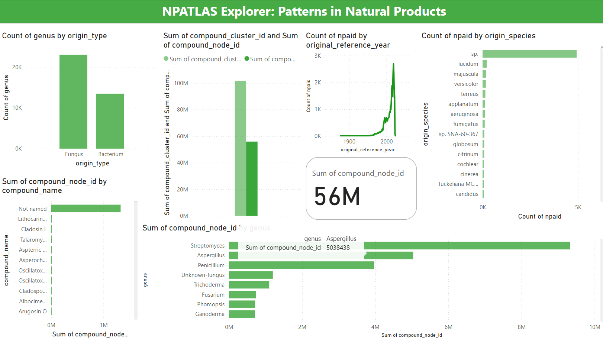

# Data Analysis Steps Explained
Here’s a well-structured breakdown of the steps followed for the data analysis, ensuring clarity and conciseness while outlining the key points of each step:

## 📦 Imports
The first step in the analysis is to import necessary libraries. This includes:

```python
import pandas as pd
import seaborn as sns
import matplotlib.pyplot as plt
import os
```

- `pandas` for handling data structures.
- `seaborn` for data visualization.
- `matplotlib.pyplot` for plotting.
- `os` for interacting with the file system.

## 📂 Loading Data

The next step is loading the NP Atlas dataset. We first ensure the existence of a directory named `data` to store the dataset. Then, we load the dataset from a tab-separated file (`NPAtlas.tsv`) into a pandas DataFrame using the following code:

```python
os.makedirs("data", exist_ok=True)
data = os.path.join("data", "NPAtlas.tsv")
df = pd.read_csv(data, sep="\t", low_memory=False)
```

## 📊 Full Dataset Column Overview

The table below provides an overview of the dataset columns, including their data types, whether they are required, and whether they are used in the project or not. In Required, yes means the values must be there and No can mean the values may be null:

| Column Name                        | Data Type | Required | Used |
|------------------------------------|-----------|----------|------|
| npaid                              | object    | Yes      | Yes  |
| compound_id                        | int64     | Yes      | No   |
| compound_name                      | object    | Yes      | Yes  |
| compound_molecular_formula         | object    | Yes      | Yes  |
| compound_molecular_weight          | float64   | Yes      | Yes  |
| compound_accurate_mass             | float64   | Yes      | Yes  |
| compound_m_plus_h                  | float64   | Yes      | Yes  |
| compound_m_plus_na                 | float64   | Yes      | Yes  |
| compound_inchi                     | object    | Yes      | Yes  |
| compound_inchikey                  | object    | Yes      | Yes  |
| compound_smiles                    | object    | Yes      | Yes  |
| compound_cluster_id                | int64     | Yes      | Yes  |
| compound_node_id                   | int64     | Yes      | Yes  |
| origin_type                        | object    | Yes      | Yes  |
| genus                              | object    | Yes      | Yes  |
| origin_species                     | object    | Yes      | Yes  |
| original_reference_author_list     | object    | Yes      | Yes  |
| original_reference_year            | int64     | Yes      | Yes  |
| original_reference_issue           | object    | No       | Yes  |
| original_reference_volume          | object    | No       | Yes  |
| original_reference_pages           | object    | No       | Yes  |
| original_reference_doi             | object    | Yes      | Yes  |
| original_reference_pmid            | float64   | No       | Yes  |
| original_reference_title           | object    | Yes      | Yes  |
| original_reference_type            | object    | Yes      | Yes  |
| original_journal_title             | object    | Yes      | Yes  |
| synonyms_dois                      | object    | No       | Yes  |
| reassignment_dois                  | object    | No       | Yes  |
| synthesis_dois                     | object    | No       | Yes  |
| mibig_ids                          | object    | No       | Yes  |
| gnps_ids                           | object    | No       | Yes  |
| cmmc_ids                           | object    | No       | Yes  |
| npmrd_id                           | object    | No       | Yes  |
| npatlas_url                        | object    | Yes      | Yes  |

## 👀 Quick Look at the Data
Before diving deeper into analysis, we first inspect the dataset’s structure to understand its contents. This includes:

- Viewing the first few rows using df.head().
- Checking the shape of the DataFrame and the data types of columns with df.shape and df.dtypes.
- Ensuring there are no duplicate rows by calling df.duplicated().sum().
- Identifying any missing values with df.isnull().sum().

## Data Cleaning

### Filling Missing Data
We address missing values by copying the original DataFrame and converting all columns to object type before applying the replacement of Null values with NaN. This is because pandas columns with numeric or float types do not convert their NaN values to None — they stick to NaN because None is a Python object, and numeric columns can’t store it. Normally, we leave the null values alone for the exploratory analysis.

### Exploring Dataset Columns
We explore the dataset columns to identify unique values. Columns like 'npaid', 'compound_id', and 'npatlas_url' contain unique entries, while other columns have duplicate values indicating shared entries.

### Dropping Redundant Columns
Upon realizing that the 'compound_id' is functionally equivalent to 'npaid', we drop 'compound_id' to avoid redundancy.

## 🔍 Exploring Data Distribution
We further explore the data by:

- Checking for duplicate compound names and molecular formulas to identify common patterns and redundancies.
- Summarizing molecular weight and accurate mass values.
- Calculating the differences between measured adducts ([M+H], [M+Na]) and accurate mass.

### InChIKey Investigation
We investigate the 'InChIKey' column, which represents hashed chemical structures. Duplicates here can indicate synonyms or data redundancies. We analyze duplicates and identify any inconsistencies in 'npaid' and 'compound_name' mappings.

After carefully analyzing the duplicates, we drop entries that have redundant InChIKeys with the same compound names.

### Exploring Compound Clusters, Nodes, and Origins
We analyze the compound clusters and their associated metadata, including the number of compounds per cluster. For instance, we find that Cluster 26 and 46 are significantly larger than others. We also explore the taxonomic origins (e.g., genus, species) of compounds within a cluster to understand their biological sources.

### Handling Metadata Columns
We focus on six columns related to metadata and reformat them to handle missing or empty values (represented by "[]"). We standardize these entries to None and drop these columns due to their high proportion of missing values.

```python
df_cleaned.loc[:, ["synonyms_dois", "reassignment_dois", "synthesis_dois", "mibig_ids", "gnps_ids", "cmmc_ids"]] = df_cleaned[["synonyms_dois", "reassignment_dois", "synthesis_dois", "mibig_ids", "gnps_ids", "cmmc_ids"]].replace("[]", None)
```

## Data Visualization
After data cleaning, we begin visualizing different aspects of the data:

1. Most Common Compound Names:
We visualize the top 10 most common compound names using a barplot to understand the distribution of compounds.

```python
sns.barplot(x=common_compound_names.values, y=common_compound_names.index)
```

2. Top 10 Clusters by Compound Count:
A bar plot highlights the 10 largest clusters based on the number of compounds.

```python
sns.barplot(x=cluster_size.index, y=cluster_size.values)
```

3. Cluster Size vs Genus Diversity:
A scatter plot shows the relationship between cluster size and the diversity of genera within clusters.

```python
sns.scatterplot(x=cluster_sizes, y=cluster_genus_diversity)
```

4. Compound Diversity within Clusters:
A pie chart visualizes the diversity of compounds within the top clusters based on genus.

```python
plt.pie(cluster_diversity, labels=cluster_diversity.index, autopct='%1.1f%%')
```

5. Top Origin Genera in Specific Clusters:
For a specific cluster (e.g., Cluster 46), we visualize the top genera contributing to the cluster.

```python
sns.barplot(data=top_genera_df, x='count', y='genus', hue='genus')
```

6. Molecular Weight Distribution:
A histogram visualizes the distribution of molecular weights across compounds.

```python
sns.histplot(df_cleaned['compound_molecular_weight'], bins=100, color='steelblue')
```

7. Mass Difference Analysis:
A boxplot shows the distribution of differences between accurate mass and the measured m+H and m+Na values.

```python
sns.boxplot(data=diffs)
```

8. Top Origin Types and Species:
Bar plots visualize the top origin types and species contributing to compound production.

```python
sns.barplot(x=origin_counts.values, y=origin_counts.index)
```

### InChIKey and Reference Analysis
We perform additional analysis on:

- The proportion of duplicate InChIKeys.
- Conflicting InChIKeys based on compound names.
- Distribution of original reference years for the compounds.
- External metadata availability and unavailability, such as DOI links.

## Final Data Preparation
Lastly, a subset of the cleaned data is extracted as a sample for further use. This sample is saved as a new TSV file [test_data.tsv] for future analysis.

## POWER BI Dashboard

## 📊 NPAtlas Power BI Dashboard

Below is a snapshot of the NPAtlas Power BI dashboard, which provides interactive visualizations for exploring compound distributions, clusters, origins, and reference year insights:


